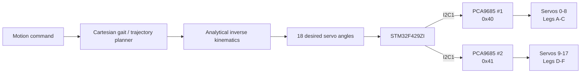
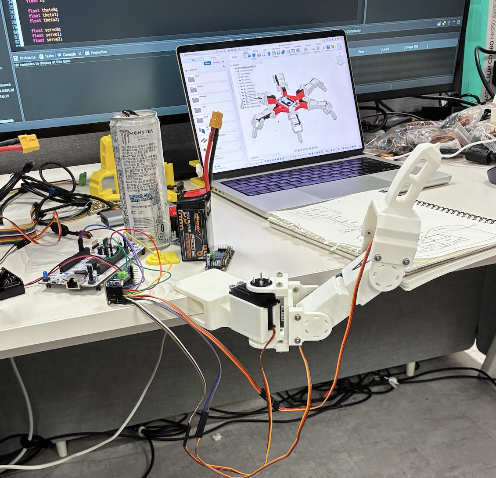
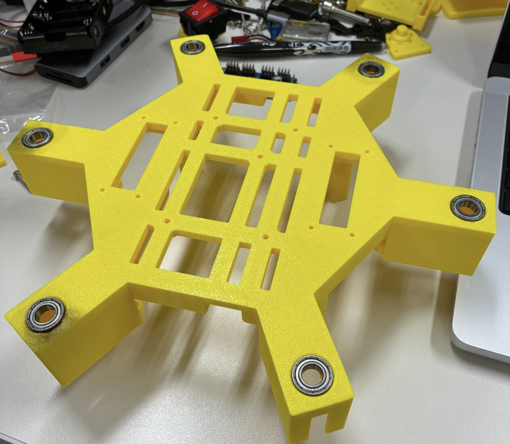
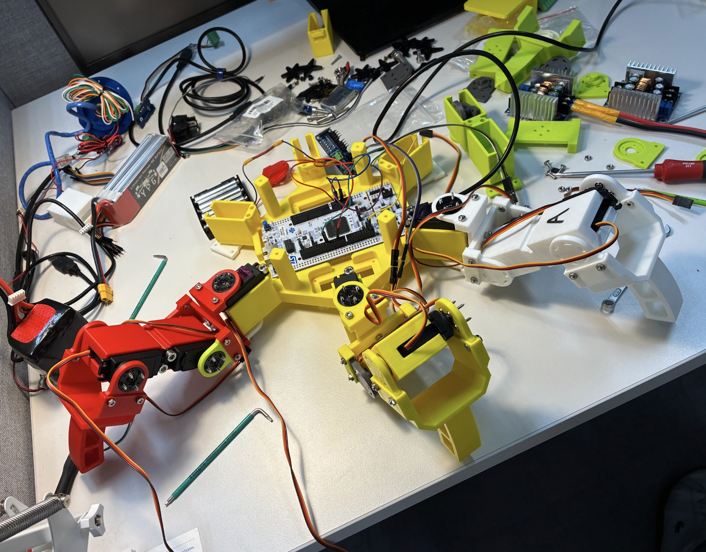
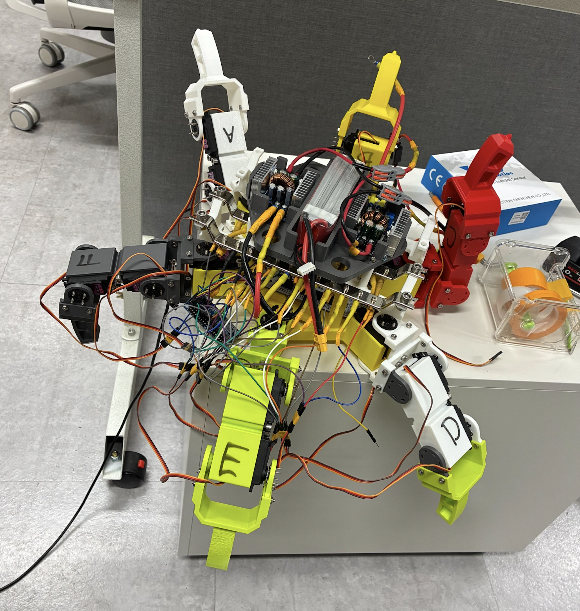
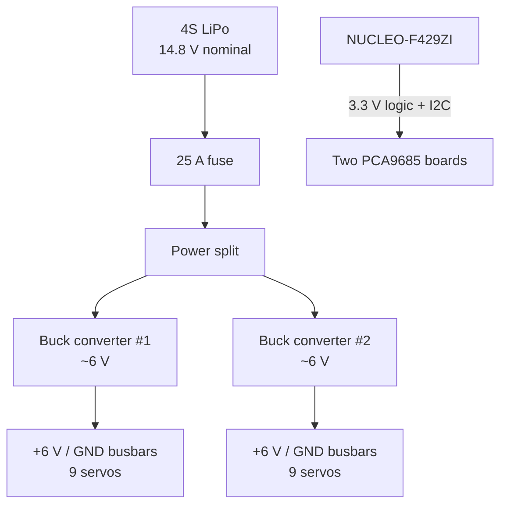
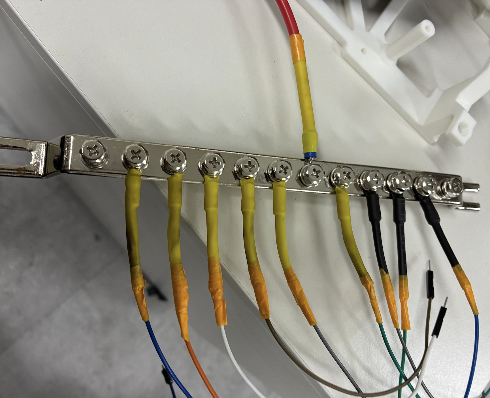
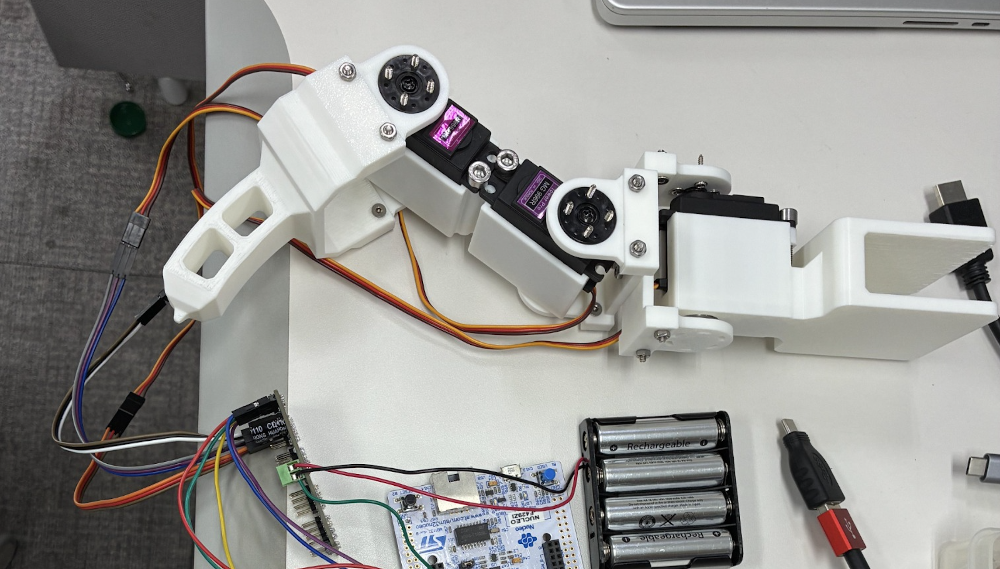
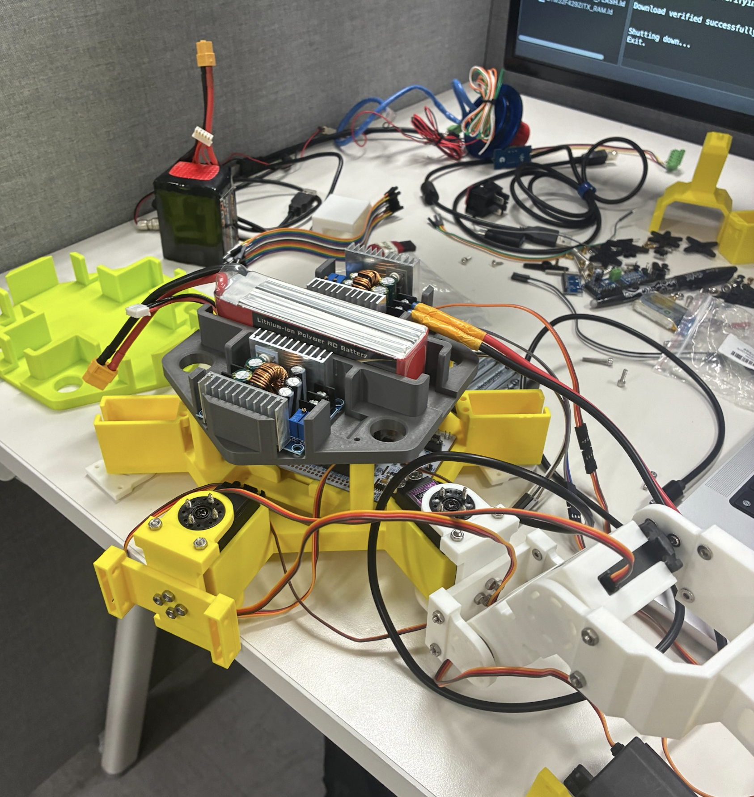
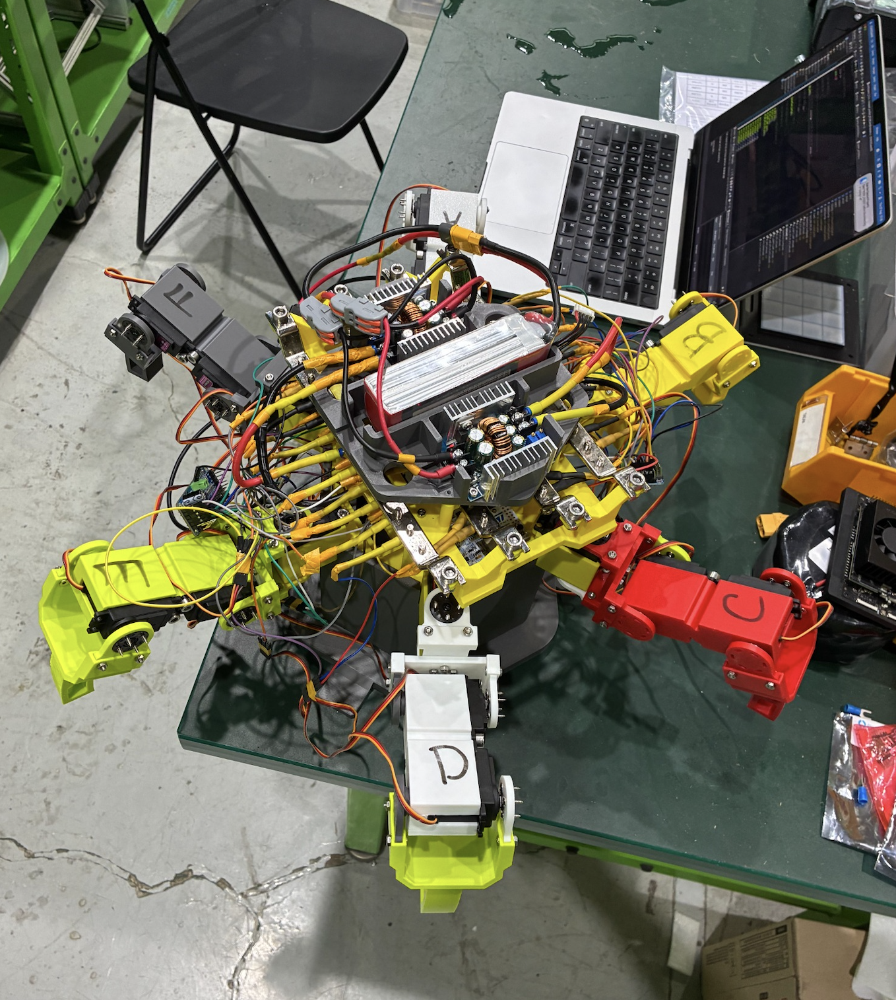

# 18-DOF STM32 Hexapod Robot

A six-legged walking robot designed and built around an **STM32 NUCLEO-F429ZI**, **18 MG996R-class servos**, and **two PCA9685 PWM controllers**. The robot uses analytical inverse kinematics, Cartesian foot trajectories, and an alternating-tripod gait to coordinate all 18 joints.

<p align="center">
  <video src="media/final/walking_demo.mp4" width="520" alt="Hexapod walking demo">
</p>

<p align="center">
  <a href="media/final/walking_demo.mp4">Full walking demo (MP4)</a>
</p>

## Project overview

The goal of this project was to build a complete hexapod platform from mechanical design through embedded control and power integration. Each leg has three actuated joints and is commanded in a local Cartesian coordinate frame. Desired foot positions are converted to servo angles with analytical inverse kinematics, allowing motion to be expressed as trajectories in `(x, y, z)` rather than as direct joint commands.

The final robot can:

- Coordinate **18 independently calibrated servos**.
- Generate and validate **straight-line** and **upward semicircular** foot trajectories.
- Walk in arbitrary planar directions using an **alternating-tripod gait**.
- Change its stance height with `Vertical()`.
- Expand or contract its footprint with `Spread()`.
- Reject an entire requested motion before actuation if any generated trajectory point is unreachable or violates the permitted joint range.

## System architecture



The firmware separates the project into two main modules:

- `servo.c / servo.h` — PCA9685 communication, logical-servo mapping, and individual servo calibration.
- `motion.c / motion.h` — inverse kinematics, Cartesian trajectory generation, synchronized phase execution, stance adjustment, and walking gait logic.

## Mechanical configuration

Each leg is a 3-DOF serial chain:

| Link | Length |
|---|---:|
| Coxa (`L0`) | 50 mm |
| Femur (`L1`) | 75 mm |
| Tibia (`L2`) | 110 mm |

The six legs are arranged around the body at mounting angles of 30°, 90°, 150°, 210°, 270°, and 330°. The structural parts were iterated through multiple 3D-printed prototypes, including bearing-supported joints and a custom central chassis.

<table>
  <tr>
    <td width="48%" align="center">
      <br>
      <sub><b>3-DOF leg and joint development</b></sub>
    </td>
    <td width="52%" align="center">
      <br>
      <sub><b>Chassis design</b></sub>
    </td>
  </tr>
  <tr>
    <td width="40%" align="center">
      <br>
      <sub><b>Mechanical integration and chassis assembly</b></sub>
    </td>
    <td width="60%" align="center">
      <br>
      <sub><b>Completed hexapod robot configuration</b></sub>
    </td>
  </tr>
</table>

## Inverse kinematics

For a requested foot point `(x, y, z)` in a leg's local coordinate frame:

```text
r = sqrt(x² + y²)

theta0 = atan2(y, x)

D = ((r-L0)² + z² - L1² - L2²) / (2 L1 L2)

theta2 = atan2(-sqrt(1-D²), D)

theta1 = atan2(z, r-L0)
       - atan2(L2 sin(theta2), L1 + L2 cos(theta2))
```

The mathematical angles are then mapped into the physical servo convention used by the robot. Every trajectory sample is checked for reachability and for the permitted `-90° ... +90°` servo range before execution.

See [`docs/kinematics.md`](docs/kinematics.md) for the full coordinate and angle conventions.

## Cartesian trajectory generation

Motion primitives are sampled at **51 points (50 intervals)**:

- `StraightLine(...)` performs linear interpolation between two Cartesian endpoints.
- `SemiCircle(...)` generates an upward semicircular swing path whose diameter is the line between the initial and final foot positions.

Both functions are planners/validators only: they fill angle arrays but do not directly move the servos. `ExecutePhase()` then commands all six legs point-by-point so that the complete robot executes a synchronized phase.

## Alternating-tripod gait

The walking gait divides the robot into two tripod groups:

- **A-C-E**
- **B-D-F**

During each gait phase, one tripod follows an upward semicircular swing trajectory while the opposite tripod follows a straight stance trajectory in the opposite direction. Preparation and recovery phases return the robot to its original local foot configuration.

For each leg, the gait is built around three points:

- `C0` — Cartesian foot position when `Walk()` begins.
- `Cb` — backward critical position.
- `Cf` — forward critical position.

For leg mounting angle `beta` and requested walking direction `dir`:

```text
gamma = beta - dir

Cb = C0 - (step_size / 2) [cos(gamma), sin(gamma), 0]
Cf = C0 + (step_size / 2) [cos(gamma), sin(gamma), 0]
```

Because `Walk()` takes its `C0` values from the persistent `current_position` state, walking also works after changing height or stance width with `Vertical()` and `Spread()`.

See [`docs/gait.md`](docs/gait.md) for the gait sequence.

## Servo control

Two PCA9685 boards share the STM32 I²C1 bus:

| Controller | I²C address | Logical servos |
|---|---:|---:|
| PCA9685 #1 | `0x40` | 0-8 |
| PCA9685 #2 | `0x41` | 9-17 |

Each logical servo has its own measured PWM values for `-90°`, `0°`, and `+90°`. `Servo_SetAngle()` uses piecewise-linear interpolation around the calibrated zero point instead of assuming all 18 servos are identical.

PWM frequency is configured at approximately 50 Hz using a PCA9685 prescale value of 121.

## Power system

The final robot uses a dedicated high-current servo power architecture rather than routing servo power through the PCA9685 boards:



The two 6 V positive rails remain separate, while all grounds share a common reference with the MCU and both PWM controllers.

<p align="center">
  
</p>

See [`docs/hardware.md`](docs/hardware.md) for the hardware and power overview.

## Firmware example

The current `main.c` initializes all servos to the nominal starting pose, contracts the footprint, lowers the stance, waits, and then performs a walking sequence:

```c
Spread(-25.0f, 1000);
Vertical(-25.0f, 1000);
HAL_Delay(15000);

Walk(0,
     15,
     80.0f,
     1000);
```

The motion API is declared in [`firmware/Core/Inc/motion.h`](firmware/Core/Inc/motion.h).

## Development progression

The project was developed incrementally rather than assembling all 18 joints at once.

| Stage | Description |
|---|---|
| 1 | 3D-printed joint and bearing-fit prototypes |
| 2 | Single 3-DOF leg assembly |
| 3 | STM32 + PCA9685 servo-control testing |
| 4 | Single-leg inverse-kinematics and trajectory testing |
| 5 | Hexagonal body/chassis fabrication |
| 6 | High-current LiPo / buck-converter power integration |
| 7 | Multi-leg assembly and calibration |
| 8 | Full six-leg gait integration |
| 9 | Ground locomotion testing |

<table>
  <tr>
    <td width="55%" align="center" valign="middle">
      
      <br>
      <sub><b>Early prototype:</b> Initial development and testing of the 3-DOF leg mechanism.</sub>
    </td>
    <td width="45%" align="center" valign="middle">
      
      <br>
      <sub><b>Power integration:</b> Prototype mounting and integration of the LiPo battery and dual buck converters.</sub>
    </td>
  </tr>
  <tr>
    <td colspan="2" align="center">
      
      <br>
      <sub><b>Final prototype:</b> Fully assembled 18-DOF hexapod with integrated electronics and power distribution.</sub>
    </td>
  </tr>
</table>

A short early single-leg motion test is available [here](media/development/single_leg_motion.mp4).

## Results

The final platform supports its own weight and demonstrates repeated ground locomotion using the alternating-tripod gait. The project validates the full chain from Cartesian trajectory generation through inverse kinematics, embedded execution, servo calibration, mechanical structure, and high-current power distribution.

Current limitations primarily concern control refinement rather than basic functionality: the gait is open-loop, there is no body-attitude or foot-contact feedback, and the trajectory parameterization uses evenly spaced geometric samples rather than a smooth velocity profile.

### Future work

Potential extensions include IMU-based body stabilization, foot/contact sensing, velocity-profile smoothing, terrain adaptation, and closed-loop gait control.

## Repository structure

```text
stm32-hexapod/
├── README.md
├── firmware/
│   └── Core/
│       ├── Inc/
│       │   ├── main.h
│       │   ├── motion.h
│       │   └── servo.h
│       └── Src/
│           ├── main.c
│           ├── motion.c
│           └── servo.c
├── docs/
│   ├── hardware.md
│   ├── kinematics.md
│   └── gait.md
└── media/
    ├── final/
    └── development/
```

> **Firmware note:** This repository focuses on the application-level source developed for the robot. Auto-generated STM32Cube startup, linker, HAL, and project-configuration files are intentionally omitted.

## Tools and technologies

- STM32 NUCLEO-F429ZI
- STM32 HAL / C
- STM32CubeIDE / STM32CubeMX
- PCA9685 PWM servo controllers
- MG996R-class hobby servos
- I²C
- Analytical inverse kinematics
- Cartesian trajectory planning
- 3D-printed mechanical structure
- LiPo + DC-DC power conversion

